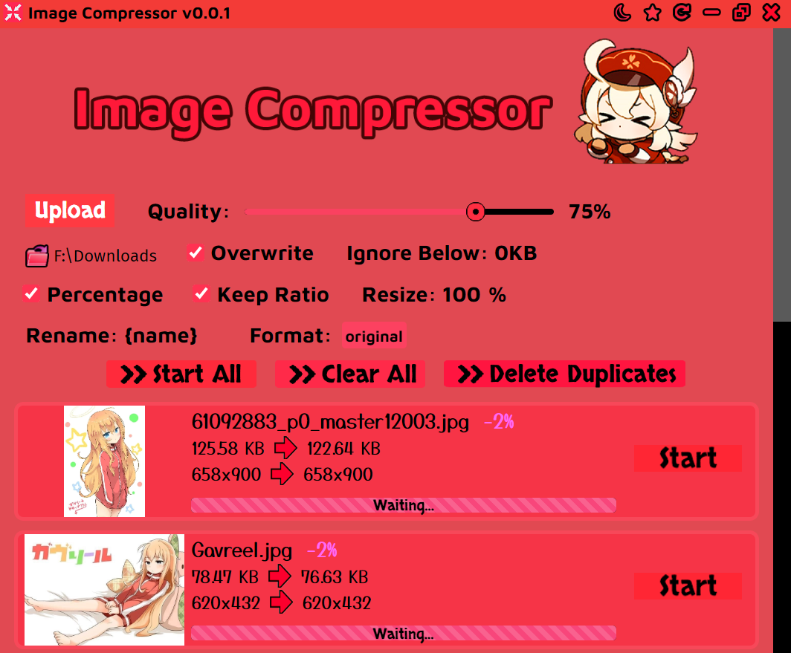

## Image Compressor



This is a bulk image compressor, resizer, and renamer. Great for organizing your anime art collection. You can reduce the size of images/GIFs, delete duplicate images, and rename pictures according to the source (from saucenao).

### Features:
- Compress and resize images (PNG/JPG/WEBP) and GIFs
- Rename pictures according to the source from saucenao (original title, artist, pixiv ID, etc.)
- Delete duplicate images (the one with the greatest dimensions is retained)
- Flatten a folder (move all files in sub-folders to the parent and delete sub-folders)
- Convert images to PDF (or a directory containing images)
- Convert PDFs to image directories
- Choose to overwrite images or write to a folder
- Ignore images under a certain file size (to avoid over-compression)
- Preview before and after images (right click on the thumbnails)

Note: Quality only affects JPG/WEBP export, PNG and GIF compression are automatic.

### Rename Template:
You can customize the output names. If it results in a blank name (eg. not found) it will default to using the same name as the input. If the "Overwrite" option is on, the original file is overwritten with the compressed file first and then renamed after. These are all the special replacements:

{name} - The name of the original file. \
{title} - The title of the Pixiv illustration, if found. \
{englishTitle} - The title, but translated to English. \
{id} - The Pixiv ID of the illustration, if found. \
{artist} - The artist of the illustration, if found. \
{width} - The destination width. \
{height} - The destination height.

### Titlebar Buttons
There are many utility functions on the titlebar. They do the following:

VTT - If ASS or SRT files are selected, they will be converted to a VTT file. If MKV videos are selected, the subtitles are
extracted and converted to VTT. If a directory is selected, all MKV, ASS, and SRT files are converted in that directory. The original files are deleted.

Rename - Select files within a directory and they are renamed according to the name of the directory. For example, if the directory is named 
"Yuru Yuri" the files will be renamed "Yuru Yuri 1", "Yuru Yuri 2", etc. going by alphabetic order.

Image Cover - If PDF files are selected, it extracts the first image (the cover image). If a directory is selected, it converts all double
pages to single pages (images with twice the width of all others). If images are selected, it converts all double pages to singles - if all images are the same width,
they are all treated as double pages. All original files are deleted.

PDF -  If PDF files are selected, it converts it into a directory of images. If directories or images are selected, it converts them into PDF files. Sometimes the first function results in PPM image files, if you select PPM files they will be converted to JPG files.

Flatten - Flattens a directory, meaning that all files in all sub-directories are moved to the top level and the sub-directories are removed. This
attempts to prevent naming conflicts by renaming files if the name would conflict with another.


### Keyboard Shortcuts
- Ctrl O - Open images
- Drag and drop - Open images

### Installation

Download the installer from the [releases](https://github.com/Moebits/Image-Compressor/releases) tab.

### MacOS

On MacOS unsigned applications won't open, run this to remove the quarantine flag.
```
xattr -d com.apple.quarantine /Applications/Image\ Compressor.app
```

### Bugs and Requests

Open an issue on my GitHub repository. 

### Also See

- [Waifu2x GUI](https://github.com/Moebits/Waifu2x-GUI) for upscaling images
- [Pixiv Downloader](https://github.com/Moebits/Pixiv-Downloader) for downloading images
- [Photo Viewer](https://github.com/Moebits/Photo-Viewer) for editing images
